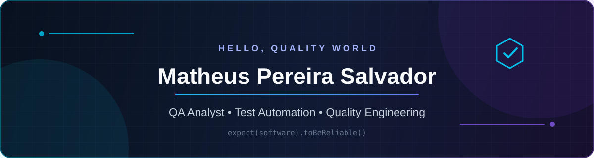

  

   

  
  

## 👋 Sobre mim

Sou **Analista de Qualidade (QA)** com foco em transformar requisitos em experiências confiáveis. Trabalho com testes manuais e automação de testes **Web, API e E2E**, sempre buscando combinar visão de negócio, prevenção de defeitos e feedback rápido para o time.

- 🧪 Experiência prática com automação usando **Cypress, Selenium e Python**
- 🔌 Testes de API, validação de contratos, status codes e regras de negócio
- 📋 Planejamento de testes, cenários **BDD/Gherkin**, evidências e relatórios de bugs
- ⚡ Testes de performance com **k6** e integração de testes em pipelines de CI/CD
- 📱 Atualmente aprofundando conhecimentos em **Appium** e automação mobile

> Para mim, qualidade não é apenas encontrar bugs — é construir confiança em cada entrega.

## 🧰 Tecnologias e ferramentas

### Automação e testes

### Linguagens e dados

### DevOps e colaboração

## 🚀 Projetos em destaque

| Projeto | O que demonstra | Stack |
| :--- | :--- | :--- |
| [🍊 QA OrangeHRM](https://github.com/matheuspereirasalvador/qa-orangeHRM) | Estratégia completa de qualidade com testes E2E, API, BDD, performance, documentação e pipelines | Cypress, Cucumber, k6, GitHub Actions, Azure DevOps |
| [🛒 Swag Labs E2E](https://github.com/matheuspereirasalvador/swaglabs-cypress-automation) | Automação do fluxo de compra, cenários negativos e relatório visual de execução | Cypress, JavaScript, Mochawesome |
| [🔌 API Booking](https://github.com/matheuspereirasalvador/qa-api-booking) | Automação e validação de uma API REST de reservas | Python, API Testing |
| [📋 SauceDemo Manual](https://github.com/matheuspereirasalvador/qa-saucedemo-manual) | Planejamento e execução de testes manuais com documentação de qualidade | Test Cases, Bug Reports, QA Artifacts |

## 📊 GitHub em números

  
  
  

## 📫 Vamos conversar?

Estou sempre aberto a trocar ideias sobre **qualidade de software, automação de testes e melhoria contínua**.

  

 

  Desenvolvido com atenção aos detalhes — como todo bom teste deve ser. 🐞

